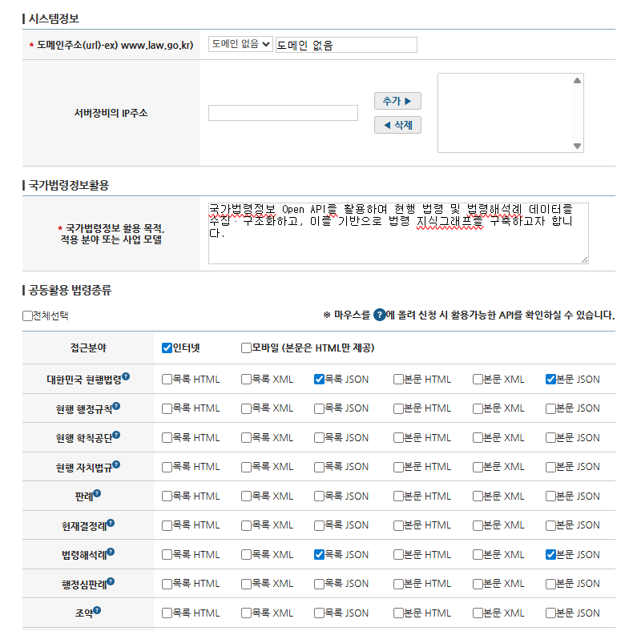

# 법령을 지식그래프로 변환하기

**Part 2. 지식그래프 구축 실전**

- Chapter 02. 지식그래프 구축하기
    - 📒 Clip 05-06. [프로젝트] 법률/법령 정보를 지식그래프로 변환하기

> 대한민국 국가법령정보센터 Open API를 활용하여 법령 구조와 법령해석례를 지식그래프로 표현하는 실습입니다.


https://open.law.go.kr/LSO/openApi/guideList.do


## 프로젝트 구성

- **1단계**: 현행법령(eflaw) API로 법령 구조 그래프 구축 (법령 → 조문 → 항 → 호)
- **2단계**: 법령해석례(expc) API로 해석 사건 노드 추가 및 기존 법령 그래프와 연결

## 그래프 스키마

### 1단계: 현행법령 구조

```
(Law)
  └─ HAS_ARTICLE → (Article)
                      └─ HAS_PARAGRAPH → (Paragraph)
                                            └─ HAS_ITEM → (Item)

(Article) ─ NEXT_ARTICLE → (Article)  # 조문 간 순차적 연결
```

**노드 타입**:
- `Law`: 법령 (법률, 대통령령, 총리령, 부령 등)
- `Article`: 조문 (제1조, 제2조 등)
- `Paragraph`: 항 (제1항, 제2항 등)
- `Item`: 호 (제1호, 제2호 등)

### 2단계: 법령해석례 확장

```
(Organization - 질의기관)
      │
      └── REQUESTED → (LegalInterpretation)
                              │
                              ├── HAS_QUESTION → (Question)
                              │                      │
                              │                      └── ANSWERED_BY → (Answer)
                              │                                           │
                              ├── HAS_ANSWER ────────────────────────────┘
                              │                                           │
                              │                                           └── SUPPORTED_BY → (Reason)
                              │
                              ├── INTERPRETS → (Law)  [주법령]
                              │
                              └── CITES → (Law/Article/Paragraph/Item)  [인용 조항 및 참조 법령]

(LegalInterpretation) ─ ANSWERED_BY → (Organization - 회신기관)
```

**노드 타입**:
- `LegalInterpretation`: 법령해석례 메타데이터 (제목, 안건번호, 회신일자)
- `Question`: 질의요지
- `Answer`: 회답 (결론: 가능/불가능/조건부/미분류)
- `Reason`: 이유
- `Organization`: 기관 (질의기관, 회신기관)

**관계**:
- `INTERPRETS`: 해석례가 **주로 다루는** 법령 (primary_law)
- `CITES`: 해석례가 **인용하는** 법령/조문/항/호 + **참조 법령** (other_laws)
- `HAS_QUESTION`: 해석례 → 질의요지
- `HAS_ANSWER`: 해석례 → 회답
- `ANSWERED_BY`: 질의 → 회답 / 해석례 → 회신기관
- `SUPPORTED_BY`: 회답 → 이유
- `REQUESTED`: 질의기관 → 해석례

## 실습 순서

### 1. API 키 발급

**신청 절차**:
1. [국가법령정보센터](https://www.law.go.kr) 회원가입 (이메일 ID 기억)
2. 상단 메뉴 **[Open API]** → **[OPEN API 신청]** → **[신청]** 클릭
3. 필요한 법령 종류 체크 후 신청서 작성 (1~2일 소요)
4. 승인 후 `.env` 파일에 `LAW_API_KEY=이메일ID` 입력



### 2. 패키지 설치

Python 3.13

```bash
# uv 설치
# Windows (PowerShell)
powershell -ExecutionPolicy ByPass -c "irm https://astral.sh/uv/install.ps1 | iex"

# macOS / Linux
curl -LsSf https://astral.sh/uv/install.sh | sh
```

```bash
# 방법 1: uv sync 사용 (권장)
uv sync
.venv\Scripts\activate
```

또는

```bash
# 방법 2: requirements.txt 사용
uv venv
.venv\Scripts\activate
uv pip install -r requirements.txt
```

### 3. 환경변수 설정

`.env.example`을 복사하여 `.env` 파일을 생성하고, 실제 값을 입력합니다:

`.env` 파일 내용:
```env
# 법제처 Open API 인증키 (OC)
# 회원가입한 이메일의 @ 앞부분만 입력!
# 예: myemail@gmail.com → LAW_API_KEY=myemail
LAW_API_KEY=이메일_아이디_입력

# Neo4j DB 연결 정보
NEO4J_URI=neo4j+s://xxxxxxxx.databases.neo4j.io
NEO4J_USERNAME=neo4j
NEO4J_PASSWORD=your_password

# OpenAI API 키 (해석례 텍스트에서 조문 추출용)
OPENAI_API_KEY=sk-your-openai-api-key
```

### 4. API 연결 테스트

```bash
python law_api.py
```

- API 키 유효성 검증
- 현행법령(eflaw) API 연결 테스트
- 법령해석례(expc) API 연결 테스트
- 샘플 데이터 JSON 파일 생성

**출력 파일**:
- `eflaw_list_sample.json` - 현행법령 목록 샘플
- `eflaw_detail_sample.json` - 현행법령 상세 샘플
- `expc_list_sample.json` - 법령해석례 목록 샘플
- `expc_detail_sample.json` - 법령해석례 상세 샘플

### 5. Knowledge Graph 구축

**1단계: 현행법령 적재**

```bash
python step1_load_laws.py
```

**2단계: 해석례 연결**

```bash
python step2_link_interpretations.py
```

---

## Neo4j Cypher 쿼리 예제


**전체 그래프 시각화 (샘플)**
```cypher
// 특정 법령을 중심으로 한 전체 그래프 시각화
MATCH (l:Law {name: "10ㆍ29이태원참사 피해자 권리보장과 진상규명 및 재발방지를 위한 특별법"})

// 1. 조문 구조 (Law -> Article -> Paragraph -> Item)
OPTIONAL MATCH path1 = (l)-[:HAS_ARTICLE]->(a:Article)
OPTIONAL MATCH path2 = (a)-[:HAS_PARAGRAPH]->(p:Paragraph)
OPTIONAL MATCH path3 = (p)-[:HAS_ITEM]->(i:Item)
OPTIONAL MATCH path4 = (a)-[:NEXT_ARTICLE]->(next_a:Article)

// 2. 해석례 관계 (INTERPRETS, CITES)
OPTIONAL MATCH path5 = (interp:LegalInterpretation)-[:INTERPRETS]->(l)
OPTIONAL MATCH path6 = (interp2:LegalInterpretation)-[:CITES]->(l)

// 3. 해석례 내부 구조 (Question, Answer, Reason)
OPTIONAL MATCH path7 = (interp)-[:HAS_QUESTION]->(q:Question)
OPTIONAL MATCH path8 = (interp)-[:HAS_ANSWER]->(ans:Answer)
OPTIONAL MATCH path9 = (ans)-[:SUPPORTED_BY]->(r:Reason)
OPTIONAL MATCH path10 = (q)-[:ANSWERED_BY]->(ans)

// 4. 해석례와 기관 관계
OPTIONAL MATCH path11 = (org:Organization)-[:REQUESTED]->(interp)
OPTIONAL MATCH path12 = (interp)-[:ANSWERED_BY]->(org2:Organization)

// 5. 해석례가 인용한 조문들
OPTIONAL MATCH path13 = (interp)-[:CITES]->(a)
OPTIONAL MATCH path14 = (interp2)-[:CITES]->(p)
OPTIONAL MATCH path15 = (interp2)-[:CITES]->(i)

// 모든 경로 반환 (Neo4j Browser에서 그래프로 시각화됨)
RETURN l, a, p, i, next_a, interp, interp2, q, ans, r, org, org2,
       path1, path2, path3, path4, path5, path6, path7, path8, path9,
       path10, path11, path12, path13, path14, path15
```