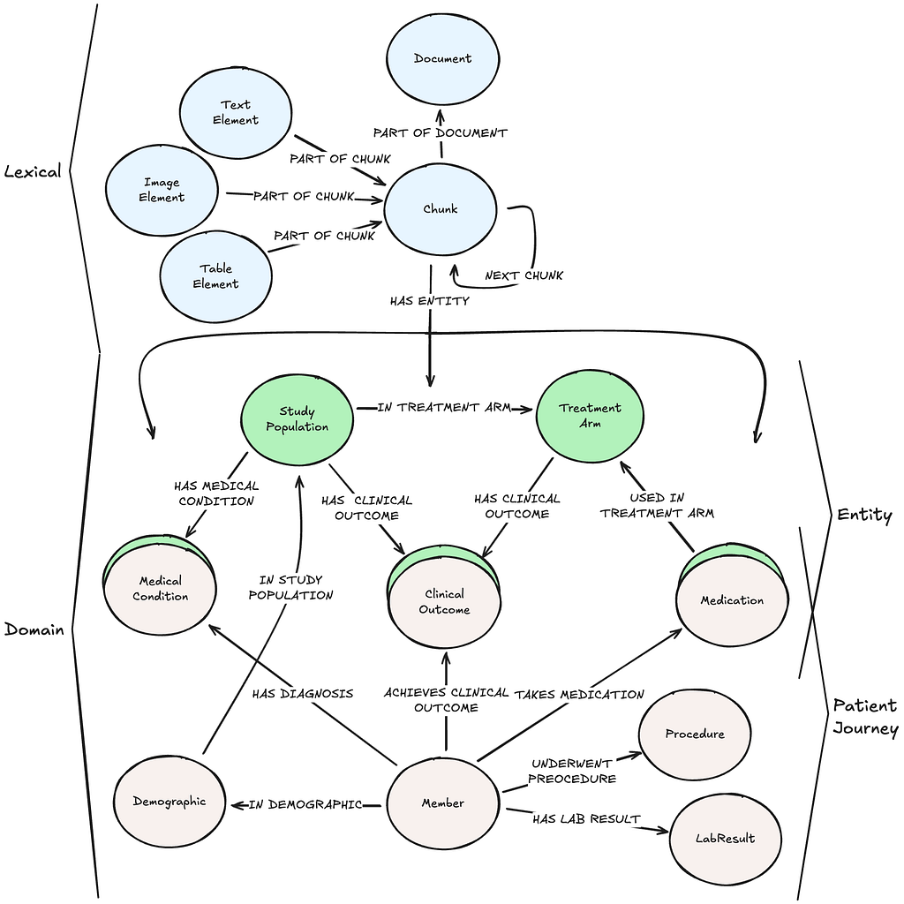

# PDF를 지식그래프로 변환하기

**Part 2. 지식그래프 구축 실전**

- Chapter 02. 지식그래프 구축하기
    - 📒 Clip 03-04. [프로젝트] PDF 문서를 지식그래프로 변환하기

> PDF 문서의 구조를 분석하고 LLM을 사용하여 지식그래프로 표현하는 실습입니다.


※ 위 예시 그래프 모델(lexical + domain graph data model)을 모범삼아 지식그래프를 구축합니다.

## 프로젝트 구성

### Stage 1: PDF 파싱 및 구조 추출 (`pdf2kg.py`)
- **목적**: PDF를 파싱하여 구조화된 데이터 생성 및 Neo4j에 저장
- **사용 라이브러리**:
  - `docling`: PDF 문서 구조 분석 및 TOC 추출 ([docling-hierarchical-pdf](https://github.com/krrome/docling-hierarchical-pdf))
  - `neo4j`: 그래프 데이터베이스 저장
- **출력**:
  1. JSON 파일 (`output/*_structure.json`) - 중간 데이터
  2. 텍스트 파일 (`output/*_toc_structure.txt`) - TOC 구조 요약
  3. Neo4j 그래프 데이터베이스:
     - Document 노드 (1개)
     - TOC 노드 (Level1~Level5, 계층 구조)
     - Chunk 노드 (TOC의 leaf 노드별)
     - TextElement, TableElement 노드
     - 관계: `HAS_TOC`, `HAS_CHILD`, `HAS_CHUNK`, `HAS_ELEMENT`

### Stage 2: 도메인 엔티티 & 관계 추출 (`pdf2kg_2.py`)
- **목적**: LLM을 사용하여 텍스트 Chunk에서 도메인 엔티티 및 관계 추출
- **사용 라이브러리**:
  - `openai`: GPT-4o API
  - `neo4j`: 그래프 데이터베이스
- **입력**: Stage 1에서 생성된 Neo4j 그래프
- **스키마 생성**: LLM이 Chunk를 분석하여 자동으로 그래프 스키마 생성
- **출력**:
  - DomainEntity 노드 (LLM 생성 스키마 기반, 동적 레이블)
  - 동적 관계 타입 (IMPLEMENTS, HAS_METRIC, REGULATES 등 - 스키마에 따라 변경)
  - HAS_ENTITY 관계 (Chunk → DomainEntity)

## 지식그래프 스키마

### Stage 1 출력 (구조적 그래프)
```
Document
└─[:HAS_TOC]─> TOC (Level1)
   └─[:HAS_CHILD]─> TOC (Level2)
      └─[:HAS_CHILD]─> TOC (Level3)
         └─[:HAS_CHUNK]─> Chunk
            └─[:HAS_ELEMENT]─> Element (TextElement/TableElement)
```

### Stage 2 출력 (도메인 그래프)
```
Chunk
└─[:HAS_ENTITY]─> DomainEntity (Policy/Technology/Metric/...)
   └─[:IMPLEMENTS|REGULATES|HAS_METRIC|...]─> DomainEntity (다른 엔티티)
```


---

## 실습 순서

### 실습에 사용할 PDF 문서

SPRi 소프트웨어 정책연구소 AI 브리프 2026년 2월호 PDF 문서
- https://spri.kr/posts/view/23950?code=AI-Brief&s_year=&data_page=1


### 1. 패키지 설치

Python 3.13

```bash
# uv 설치
# Windows (PowerShell)
powershell -ExecutionPolicy ByPass -c "irm https://astral.sh/uv/install.ps1 | iex"

# macOS / Linux
curl -LsSf https://astral.sh/uv/install.sh | sh
```

```bash
# 방법 1: uv sync 사용 (권장)
uv sync
.venv\Scripts\activate
```

또는

```bash
# 방법 2: requirements.txt 사용
uv venv
.venv\Scripts\activate
uv pip install -r requirements.txt
```

### 2. 환경변수 설정

```bash
cp .env.example .env
```

```bash
# Neo4j 연결 정보
NEO4J_URI=bolt://localhost:7687
NEO4J_USERNAME=neo4j
NEO4J_PASSWORD=your_password_here

# OpenAI API 키 (Stage 2에서 사용)
OPENAI_API_KEY=sk-your_openai_api_key_here
```

---

## 실행 방법

### Stage 1: PDF 파싱 및 구조 추출

```bash
python pdf2kg.py
```

실행 결과:
- `{}.pdf` 파싱 (docling 사용)
- `output/*_structure.json` 생성 (구조화된 데이터)
- `output/*_toc_structure.txt` 생성 (TOC 요약)
- Neo4j에 Document, TOC, Chunk, Element 노드 생성

### Stage 2: 도메인 엔티티/관계 추출

**Stage 1 실행 후** Neo4j에 데이터가 있는 상태에서 실행:

```bash
python pdf2kg_2.py
```