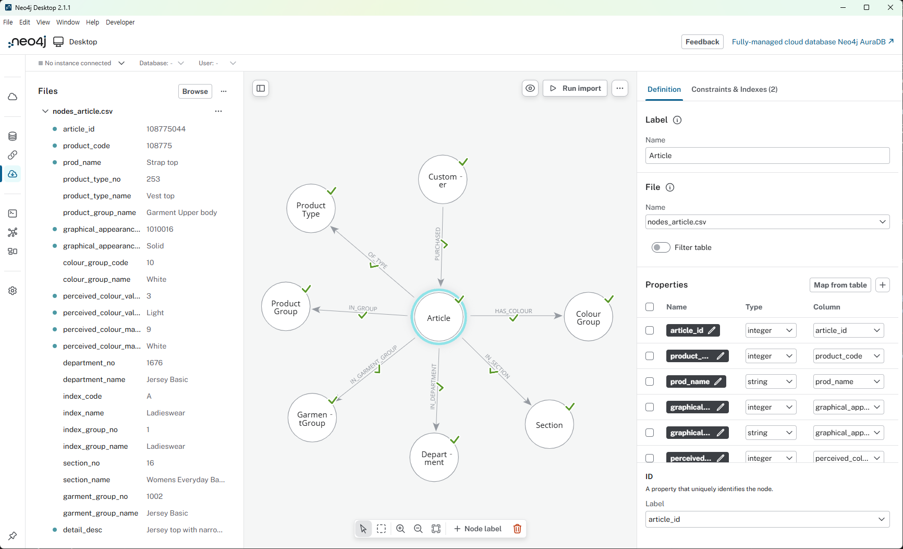

# 캐글 상품 데이터를 지식그래프로 변환하기

**Part 2. 지식그래프 구축 실전**

- Chapter 02. 지식그래프 구축하기
    - 📒 Clip 07. [프로젝트] 캐글 상품 구매이력 데이터를 지식그래프로 변환하기

> H&M 구매 이력 데이터를 지식그래프로 표현하는 실습입니다.


https://www.kaggle.com/competitions/h-and-m-personalized-fashion-recommendations/data


## 실습 순서

### 1. 데이터 준비

Kaggle에서 H&M 데이터셋을 다운로드하여 `datasets/` 폴더에 배치:
- `articles.csv`
- `customers.csv`
- `transactions_train.csv`

### 2. 패키지 설치

Python 3.13

```bash
# uv 설치
# Windows (PowerShell)
powershell -ExecutionPolicy ByPass -c "irm https://astral.sh/uv/install.ps1 | iex"

# macOS / Linux
curl -LsSf https://astral.sh/uv/install.sh | sh
```

```bash
# 방법 1: uv sync 사용 (권장)
uv sync
.venv\Scripts\activate
```

또는

```bash
# 방법 2: requirements.txt 사용
uv venv
.venv\Scripts\activate
uv pip install -r requirements.txt
```

**Jupyter Notebook 사용시 커널 등록:**

```bash
.venv\Scripts\python.exe -m ipykernel install --user --name=retail2kg --display-name="retail2kg"
```

커널 등록 후 VS Code를 리로드하면 노트북에서 "retail2kg" 커널을 선택할 수 있습니다.


## 상품 구매 이력 데이터를 지식그래프로 적재하는 방식

```
Customer
   └─ PURCHASED (t_dat, price, sales_channel_id)
            │
            Article
   ├─ HAS_TYPE → ProductType
   ├─ HAS_COLOUR → ColourGroup
   ├─ IN_SECTION → Section
   ├─ IN_GARMENT_GROUP → GarmentGroup
   ├─ IN_DEPARTMENT → Department
   └─ HAS_INDEX → Index
```

### 1) neo4j-admin import (대용량 추천)

[Neo4j Admin and Neo4j CLI 참고 자료](https://neo4j.com/docs/operations-manual/current/neo4j-admin-neo4j-cli/)

#### 1단계: CSV 파일 준비
```python
# hnm_recommendations.ipynb 실행하여 output/ 폴더에 CSV 생성
# - nodes_article.csv, nodes_customer.csv, ...
# - rels_purchased.csv, rels_of_type.csv, ...
```

#### 2단계: Neo4j import 폴더로 복사
```powershell
# Neo4j 데이터베이스 경로 확인 (Neo4j Desktop > ... > Open > Instance Folder 혹은 Open Path)
# 예: C:\Users\<username>\AppData\Local\Neo4j\relate-data\dbmss\dbms-xxxxx

# import 폴더로 CSV 파일 복사
Copy-Item ".\output_admin\*.csv" -Destination "C:\Users\<username>\.Neo4jDesktop2\Data\dbmss\dbms-xxxx\import\"
```

#### 3단계: 데이터베이스 정지
- Neo4j Desktop에서 데이터베이스 **Stop** 버튼 클릭

#### 4단계: neo4j-admin import 실행
```powershell
# 1. Java 환경 변수 설정
$env:JAVA_HOME = "C:\Users\<username>\.Neo4jDesktop2\Cache\runtime\zulu21.44.17-ca-jdk21.0.8-win_x64"
$env:PATH = "$env:JAVA_HOME\bin;$env:PATH"

# 2. DBMS 경로로 이동
cd "C:\Users\<username>\.Neo4jDesktop2\Data\dbmss\dbms-xxxxx"

# 3. import 경로 변수 설정
$importPath = "C:\Users\<username>\.Neo4jDesktop2\Data\dbmss\dbms-xxxxx\import"

# 4. neo4j-admin import 실행
.\bin\neo4j-admin.bat database import full neo4j --overwrite-destination --nodes=Article="$importPath\nodes_article.csv" --nodes=Customer="$importPath\nodes_customer.csv" --nodes=ProductType="$importPath\nodes_product_type.csv" --nodes=ProductGroup="$importPath\nodes_product_group.csv" --nodes=ColourGroup="$importPath\nodes_colour_group.csv" --nodes=Department="$importPath\nodes_department.csv" --nodes=Section="$importPath\nodes_section.csv" --nodes=GarmentGroup="$importPath\nodes_garment_group.csv" --relationships=PURCHASED="$importPath\rels_purchased.csv" --relationships=OF_TYPE="$importPath\rels_of_type.csv" --relationships=IN_GROUP="$importPath\rels_in_group.csv" --relationships=HAS_COLOUR="$importPath\rels_has_colour.csv" --relationships=IN_DEPARTMENT="$importPath\rels_in_department.csv" --relationships=IN_SECTION="$importPath\rels_in_section.csv" --relationships=IN_GARMENT_GROUP="$importPath\rels_in_garment_group.csv"

```

**일반적인 오류 해결:**
- `Unable to determine the path to java.exe` → 위 Java 환경변수 설정 필요
- `UnsupportedClassVersionError` → Java 21 사용 (Java 17은 Neo4j 5.x와 호환 안됨)
- `The database is in use` → Neo4j Desktop에서 데이터베이스 Stop 필요
- `Missing header of type START_ID` → CSV 헤더 형식 불일치


#### 5단계: 데이터베이스 시작 및 제약조건 생성
```cypher
CREATE CONSTRAINT FOR (a:Article) REQUIRE a.article_id IS UNIQUE;
CREATE CONSTRAINT FOR (c:Customer) REQUIRE c.customer_id IS UNIQUE;
CREATE CONSTRAINT FOR (p:ProductType) REQUIRE p.product_type_no IS UNIQUE;
CREATE CONSTRAINT FOR (p:ProductGroup) REQUIRE p.name IS UNIQUE;
CREATE CONSTRAINT FOR (c:ColourGroup) REQUIRE c.colour_group_code IS UNIQUE;
CREATE CONSTRAINT FOR (d:Department) REQUIRE d.department_no IS UNIQUE;
CREATE CONSTRAINT FOR (s:Section) REQUIRE s.section_no IS UNIQUE;
CREATE CONSTRAINT FOR (g:GarmentGroup) REQUIRE g.garment_group_no IS UNIQUE;
```


### 2) Import 기능 사용




### 3) Python 드라이버 쿼리 실행

```bash
python retail2kg.py
```

### 4) LOAD CSV 사용 (노드 및 소규모 관계만)

`hnm_recommendations.ipynb`를 실행하여 `output/` 폴더에 CSV 파일 생성한 후 Neo4j 쿼리 창에서 아래 쿼리를 실행합니다.

#### LOAD CSV 쿼리 예시

```cypher
// 1. 기존 데이터 삭제
MATCH (n) DETACH DELETE n;

// 2. 제약조건 생성
CREATE CONSTRAINT IF NOT EXISTS FOR (a:Article) REQUIRE a.article_id IS UNIQUE;
CREATE CONSTRAINT IF NOT EXISTS FOR (c:Customer) REQUIRE c.customer_id IS UNIQUE;
CREATE CONSTRAINT IF NOT EXISTS FOR (p:ProductType) REQUIRE p.product_type_no IS UNIQUE;
CREATE CONSTRAINT IF NOT EXISTS FOR (p:ProductGroup) REQUIRE p.name IS UNIQUE;
CREATE CONSTRAINT IF NOT EXISTS FOR (c:ColourGroup) REQUIRE c.colour_group_code IS UNIQUE;
CREATE CONSTRAINT IF NOT EXISTS FOR (d:Department) REQUIRE d.department_no IS UNIQUE;
CREATE CONSTRAINT IF NOT EXISTS FOR (s:Section) REQUIRE s.section_no IS UNIQUE;
CREATE CONSTRAINT IF NOT EXISTS FOR (g:GarmentGroup) REQUIRE g.garment_group_no IS UNIQUE;

// 3. 노드 생성 - Article
LOAD CSV WITH HEADERS FROM 'file:///nodes_article.csv' AS row
CREATE (a:Article {
    article_id: toInteger(row.article_id),
    product_code: toInteger(row.product_code),
    prod_name: row.prod_name,
    graphical_appearance_no: toInteger(row.graphical_appearance_no),
    graphical_appearance_name: row.graphical_appearance_name,
    perceived_colour_value_id: toInteger(row.perceived_colour_value_id),
    perceived_colour_value_name: row.perceived_colour_value_name,
    perceived_colour_master_id: toInteger(row.perceived_colour_master_id),
    perceived_colour_master_name: row.perceived_colour_master_name,
    detail_desc: row.detail_desc
});

// 4. 노드 생성 - Customer
LOAD CSV WITH HEADERS FROM 'file:///nodes_customer.csv' AS row
CREATE (c:Customer {
    customer_id: row.customer_id,
    FN: toFloat(row.FN),
    Active: toFloat(row.Active),
    club_member_status: row.club_member_status,
    fashion_news_frequency: row.fashion_news_frequency,
    age: toInteger(row.age),
    postal_code: row.postal_code
});

// 5. 노드 생성 - ProductType
LOAD CSV WITH HEADERS FROM 'file:///nodes_product_type.csv' AS row
CREATE (p:ProductType {
    product_type_no: toInteger(row.product_type_no),
    product_type_name: row.product_type_name
});

// 6. 노드 생성 - ProductGroup
LOAD CSV WITH HEADERS FROM 'file:///nodes_product_group.csv' AS row
CREATE (p:ProductGroup {
    name: row.name
});

// 7. 노드 생성 - ColourGroup
LOAD CSV WITH HEADERS FROM 'file:///nodes_colour_group.csv' AS row
CREATE (c:ColourGroup {
    colour_group_code: toInteger(row.colour_group_code),
    colour_group_name: row.colour_group_name
});

// 8. 노드 생성 - Department
LOAD CSV WITH HEADERS FROM 'file:///nodes_department.csv' AS row
CREATE (d:Department {
    department_no: toInteger(row.department_no),
    department_name: row.department_name
});

// 9. 노드 생성 - Section
LOAD CSV WITH HEADERS FROM 'file:///nodes_section.csv' AS row
CREATE (s:Section {
    section_no: toInteger(row.section_no),
    section_name: row.section_name
});

// 10. 노드 생성 - GarmentGroup
LOAD CSV WITH HEADERS FROM 'file:///nodes_garment_group.csv' AS row
CREATE (g:GarmentGroup {
    garment_group_no: toInteger(row.garment_group_no),
    garment_group_name: row.garment_group_name
});

// 11. 관계 생성 - PURCHASED
/*
CALL {
  LOAD CSV WITH HEADERS FROM 'file:///rels_purchased.csv' AS row
  MATCH (c:Customer {customer_id: row.customer_id})
  MATCH (a:Article {article_id: toInteger(row.article_id)})
  CREATE (c)-[:PURCHASED {
      date: date(row.t_dat),
      price: toFloat(row.price),
      sales_channel_id: toInteger(row.sales_channel_id)
  }]->(a)
} IN TRANSACTIONS OF 1000 ROWS;
*/

// 12. 관계 생성 - OF_TYPE
LOAD CSV WITH HEADERS FROM 'file:///rels_of_type.csv' AS row
MATCH (a:Article {article_id: toInteger(row.article_id)})
MATCH (p:ProductType {product_type_no: toInteger(row.product_type_no)})
CREATE (a)-[:OF_TYPE]->(p);

// 13. 관계 생성 - IN_GROUP
LOAD CSV WITH HEADERS FROM 'file:///rels_in_group.csv' AS row
MATCH (a:Article {article_id: toInteger(row.article_id)})
MATCH (p:ProductGroup {name: row.product_group_name})
CREATE (a)-[:IN_GROUP]->(p);

// 14. 관계 생성 - HAS_COLOUR
LOAD CSV WITH HEADERS FROM 'file:///rels_has_colour.csv' AS row
MATCH (a:Article {article_id: toInteger(row.article_id)})
MATCH (c:ColourGroup {colour_group_code: toInteger(row.colour_group_code)})
CREATE (a)-[:HAS_COLOUR]->(c);

// 15. 관계 생성 - IN_DEPARTMENT
LOAD CSV WITH HEADERS FROM 'file:///rels_in_department.csv' AS row
MATCH (a:Article {article_id: toInteger(row.article_id)})
MATCH (d:Department {department_no: toInteger(row.department_no)})
CREATE (a)-[:IN_DEPARTMENT]->(d);

// 16. 관계 생성 - IN_SECTION
LOAD CSV WITH HEADERS FROM 'file:///rels_in_section.csv' AS row
MATCH (a:Article {article_id: toInteger(row.article_id)})
MATCH (s:Section {section_no: toInteger(row.section_no)})
CREATE (a)-[:IN_SECTION]->(s);

// 17. 관계 생성 - IN_GARMENT_GROUP
LOAD CSV WITH HEADERS FROM 'file:///rels_in_garment_group.csv' AS row
MATCH (a:Article {article_id: toInteger(row.article_id)})
MATCH (g:GarmentGroup {garment_group_no: toInteger(row.garment_group_no)})
CREATE (a)-[:IN_GARMENT_GROUP]->(g);
```