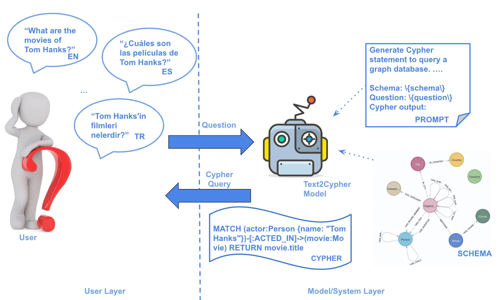

# Text2Cypher

**Part 3. GraphRAG 핵심 패턴과 평가**

- Chapter 01. GraphRAG 구축하기
    - 📒 Clip 02. [실습] Text2Cypher - 사용자 질의를 Cypher 쿼리로 변환하기

> 자연어 질문을 Cypher 쿼리로 변환하는 Text2Cypher 기법을 학습하고, Neo4j GraphRAG 패키지를 활용하여 LLM 기반 쿼리 생성 과정을 실습합니다.

---



## `text2cypher.ipynb`

이 실습에서는 **Neo4j 데이터베이스 연결 없이** Text2Cypher 변환 과정만 학습합니다.
- Neo4j GraphRAG 패키지의 Text2CypherTemplate 활용
- LLM에게 그래프 스키마 정보와 질문 제공
- 자연어가 Cypher 쿼리로 변환되는 과정 확인
- extract_cypher 함수를 사용한 쿼리 추출

---

## 실습 순서

### 1. 패키지 설치

Python 3.13

```bash
# uv 설치
# Windows (PowerShell)
powershell -ExecutionPolicy ByPass -c "irm https://astral.sh/uv/install.ps1 | iex"

# macOS / Linux
curl -LsSf https://astral.sh/uv/install.sh | sh
```

```bash
# 방법 1: uv sync 사용 (권장)
uv sync
.venv\Scripts\activate
```

또는

```bash
# 방법 2: requirements.txt 사용
uv venv
.venv\Scripts\activate
uv pip install -r requirements.txt
```


**Jupyter Notebook 사용시 커널 등록:**

```bash
.venv\Scripts\python.exe -m ipykernel install --user --name=text2cypher --display-name="text2cypher"
```


### 2. 환경변수 설정

```bash
cp .env.example .env
```

```bash
OPENAI_API_KEY=sk-your_openai_api_key_here
```

